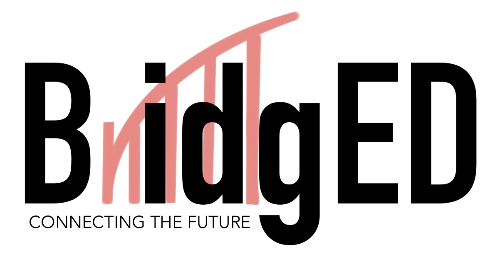

<h1>BridgED Coding Lesson 3</h1>

这是BridED编码主题第三堂课中的练习。 
在这个练习中，是一个叫做《终极密码》的游戏。 
游戏规则可在 <a href="https://zh.wikipedia.org/wiki/%E7%B5%82%E6%A5%B5%E5%AF%86%E7%A2%BC">[终极密码维基百科]</a> 中了解。 
学生们需要把缺少的编码部分填空，需要填空的部分都会有<b style="color:#4db34d;">#TODO</b>作为提示。 
 
请下载需要的py文件，在Visual Studio Code中打开py文件。 
在文件中按F5，并选择Python，便可运行游戏，游戏开始运行后可以在下方的Console中输入。 

<h3>文件用途:</h3>

<table style="border:2px solid;">
<tr><th style="border:2px solid;width:200px;">文件</th><th style="border:2px solid;width:200px;">说明</th></tr>
<tr><td style="border:1px solid;">Practice_Flowchart.pdf</td><td>游戏的流程图</td></tr>
<tr><td style="border:1px solid;">Practice_AM.py</td><td style="border:1px solid;">早上班的练习题目</td></tr>
<tr><td style="border:1px solid;">Practice_PM.py</td><td style="border:1px solid;">下午班的练习题目</td></tr>
<tr><td style="border:1px solid;">Practice_Ans.py</td><td style="border:1px solid;">练习答案</td></tr>
</table>

<h3>网站链接:</h3>
<ul>
<li><a href="https://www.bridgedacademy.com/">BridgED官网</a></li>
<li><a href="https://www.facebook.com/BridgEDAcad/">BridgED Facebook</a></li>
<li><a href="https://youtu.be/F_bXEBSEYQg">[Windows] VS Code & Python 安装指南 | Installation Guide</a></li>
</ul>

